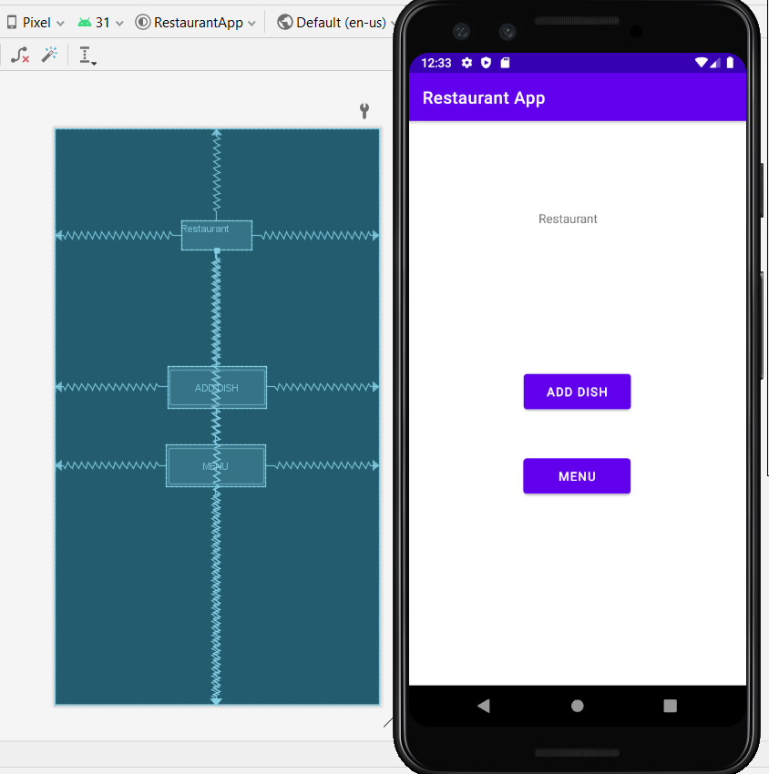
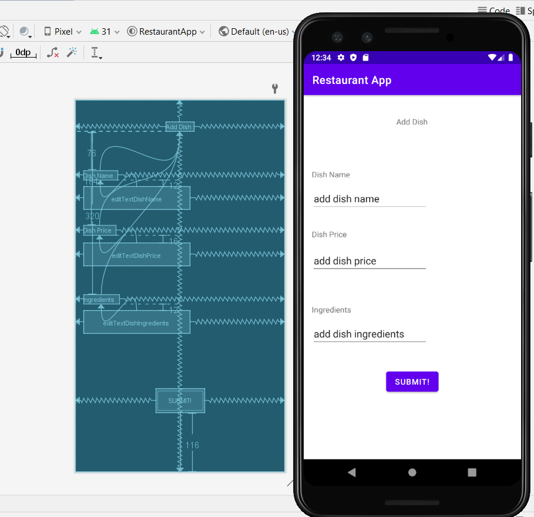
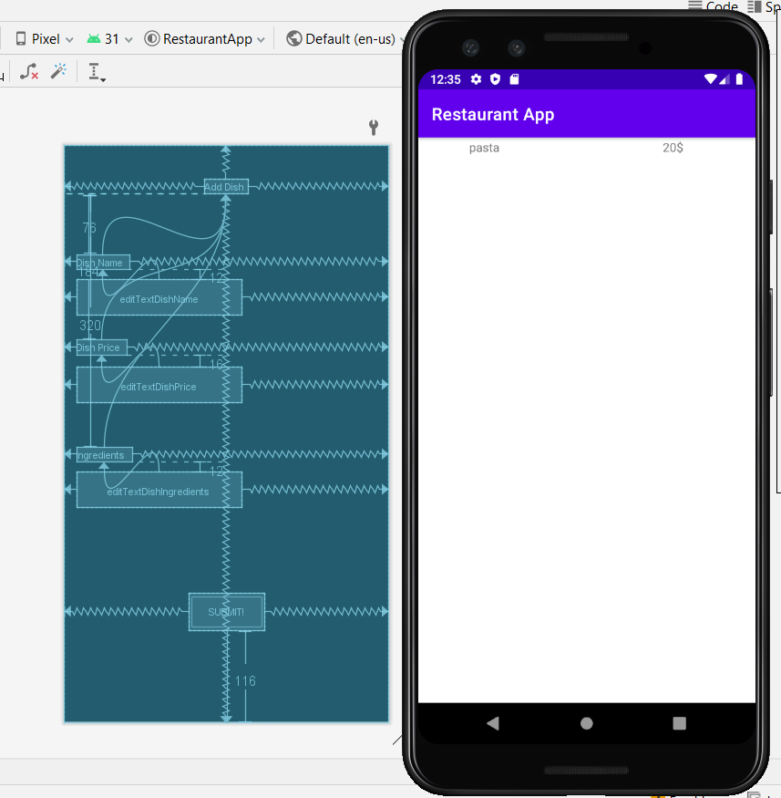
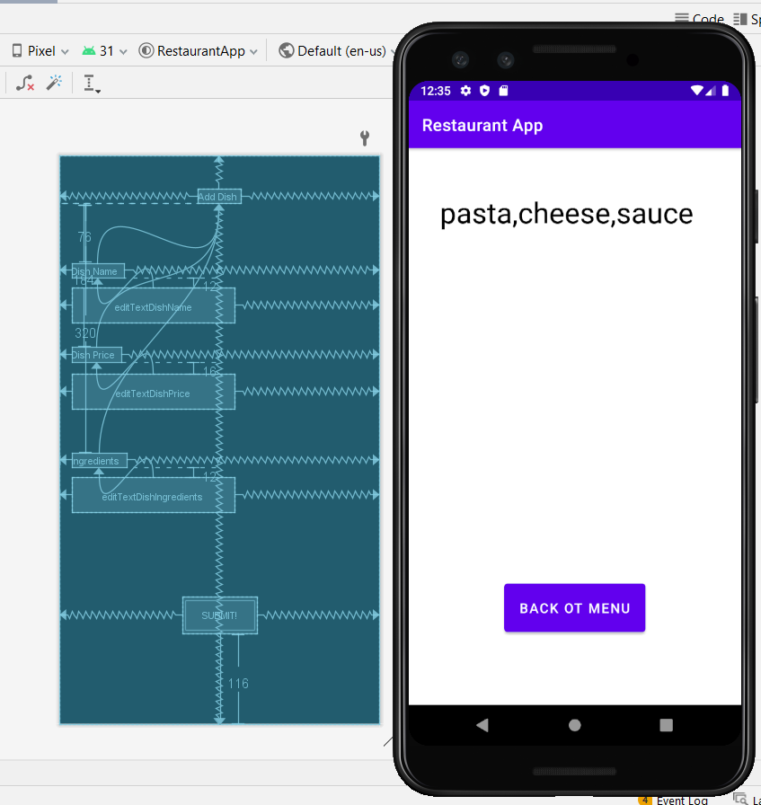

1. first screen have two buttons one go to add new dish and one to present menu

2. screen two have a form to add new dish when click submit this dish will save to database 

3. in this screen have list include dish name and dish price when click on any dish in the list tit will guide to the detail page

4. this detail page it will present all ingredents for selected item from third screen

